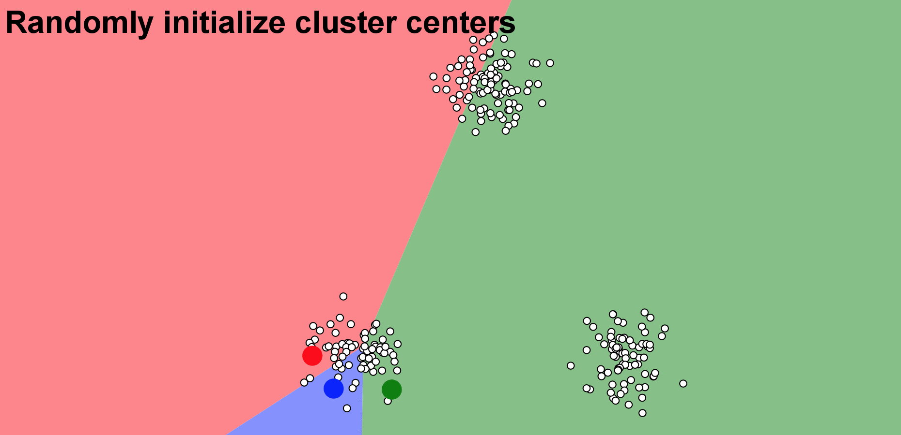
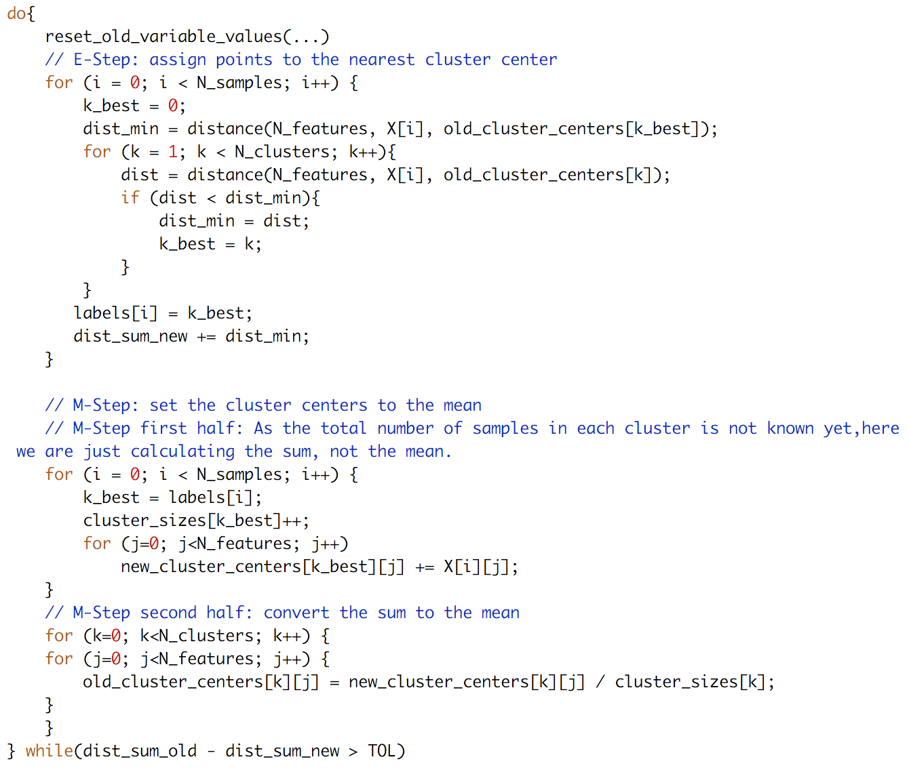

# Table of Contents
  * [Introduction](#introduction)
  * [Parallel Kmeans Algorithms](#parallel-kmeans-algorithms)
      * [MPI and hybrid MPI-OpenMP parallelization](#openmp-mpi-and-hybrid-mpi-openmp-parallelization)
      * [Advanced Feature: CUDA](#advanced-feature-cuda)
 
  
---  
# Introduction
K-means clustering is a simple and scalable clustering method, which partitions observations into k clusters in an objective manner. It has very broad applications, such as image segmentation, retail product classification (Kusrini, 2015), environmental problems like greenhouse gas emissions (Kijewska and Bluszcz, 2015). K-means clustering could be used in combination with other advanced methodologies. For example, it was used with support vector machine (SVM) to perform automatic text classification (Perrone and Connell, 2000). It could also be used as a preprocessing method, such as initialization in a hidden Markov model (HMM) (Hu and Zanibbi, 2011). Its extensive applications and its simple computational complexity make k-means clustering one of the popular methods today.

Finding the minimum of a k-means cost function is a NP-hard problem when the dimension d>1 and the number of clusters k>1. Scientists came up with several heuristic methods to find the local minimum, but the process is still computationally-intensive, especially for large datasets with high dimensional features. Therefore, we want to implement a parallel version of a k-means heuristic method on a cluster of machines, to significantly speed up the algorithm, without sacrificing its accuracy. 

A typical approach for k-mean clustering is Expectation–Maximization (E–M). E-step assigns points to the nearest cluster center, while M-step sets the cluster centers to the mean. Below is an animation demonstating the Kmean algorithm, based on a wonderful [K-means visualization made by Naftali Harris ](https://www.naftaliharris.com/blog/visualizing-k-means-clustering/).

The pseudo C-code for this algorithm is shown below, which is an abbreviated version of our real code. 

X[N_samples][N_features] is the data points. We always use i as the looping index for samples, j as the index for feature dimensions, and k as the index for clusters. This notation is consistent throught out the real code. Other variables should be self-explanatory.

---
# Parallel Kmeans Algorithms

## OpenMP, MPI and hybrid MPI-OpenMP parallelization

### MPI

With MPI, we can distribute data points to different processes using MPI_Bcast, and use MPI_Allreduce to exchange information whenever needed. Thus, both the E-step and the M-step can be parallelized. [(View our MPI code)](Parallel_Algorithm/MPI/Kmean_mpi.c)

This time, we get speed-up in both steps, so the overall scaling is better than OpenMP.

[(View the raw timing log)](Timing_Results/log/Blobs_MPI.log)

### Hybrid MPI-OpenMP

We simply add OpenMP pragmas to the MPI code, to get the hybrid version. This time we have many combinations of OpenMP threads and MPI processes to test. In general, we find that the speed-up depends on the product of the number of OpenMP threads (n_omp hereinafter) and the number of MPI processes (N_MPI hereinafter):

[(View the raw timing log)](Timing_Results/log/Blobs_hybrid.log)

Interestingly, for N_MPI*n_omp=32, we have tested 4 cases (N_MPI,n_omp) = (32,1), (16,2), (8,4) or (4,8), and all of them have almost the same speed. 
[(see the exact time use in the last cell)](https://github.com/JiaweiZhuang/CS205_final_project/blob/master/Timing_Results/plot_timing.ipynb)

### Improvements over Previous Works

Our main reference for the OpenMP&MPI Kmean algorithm is Bisgin 2008, along with their [public code](http://www.ece.northwestern.edu/~wkliao/Kmeans/index.html). We have made a couple of improvements over their original algorithm:
* Their algorithm always use the first N_cluster data points as the initial cluster center, which can be inefficient and might not find the global minimum. This is understandable because generating random indices in C is not straightforward. To facilitate random initialization and to make a fair comparison with Python's sklearn.cluster.KMeans, we build a seamless interface between C and Python using the [NetCDF library](#the-netcdf4-library-for-data-io). Random initial centers are generated by Python and written into file. Then, both the Python and the C versions use the same starting points from that file. This ensures the same amount of computation for both Python and C, along with the parallel C version at different number of cores. By using the same initial condition, we have confirmed that our serial C version has essential the same speed as Python's sklearn.cluster.KMeans, and all our parallel versions show significant speed up.
* In the OpenMP version, they use "atomic" operations in the M-step to avoid data-racing. However, in our test, atomic operation significantly slows down the M-step, which more than compensates the speed-up of E-step. To cope with this issue, we refactor the M-step to move it out of the OpenMP parallel region, making the overall scalability much better.
* In MPI the version, their orginal code is unnecessarily redundant. By making use of MPI_IN_PLACE, we avoid duplicating variables for MPI function calls such as MPI_Allreduce. We also use MPI_Scatterv, which is a more flexible version of MPI_Scatter, to allow different CPUs to hold different numbers of data points. This allows us to use any number of CPUs for any number of data points.
* We also implemented an option to use correlation as the measure of "distance". It improves the clustering results in the [SSW study](#advanced-feature-abnormal-climate-events-identification) later in this page. 

## Advanced Feature: CUDA

Given the massive potential of parallelism on GPU, we implemented a parallel version of k-means algorithm using Nvidia CUDA library. In our implementation, we parallelize the E-step by distributing the computations of the nearest distance over blocks on "device". Also, 
we use reduction to help check the convergence of clustering (see the "reduce" function). For M-step, we decide not to parallelize (parallelize means using reduction in this case), because by including the time for data to tranfer between device and host, which is a huge burden, the parallel version has no outstanding advantages over the serial version of M-step. Similar to the OpenMP version, our focus is also on the E-step. [(View our CUDA code)](Parallel_Algorithm/Cuda/kmeans_cdf.cu)

Generally, we see that the timing and scaling is quite promising when the number of threads per block is less than 32, which is also the wrap size. The "other" portion is no doubt the data tranfer between device and host, and it's even a more severe bottleneck than the serial M-step. By the way, we can definitely improve this by using better I/O hardware, i.e. using SSD instead of EBS volume for the ec2 instance, and optimizing memory access, e.g. using shared memory as possible and coalesce memory operations. Also, note that compared to OpenMP/MPI version, the time of E-step using CUDA is sinigicantly shorter. 

The weird bump up as the number of threads goes up to 64 is because we run out of shared memory, but we're not sure why it affects the M-step so much. 

For optimization, currently we've used parallel reduction to speedup the checking of convergence, and matrix transpose to improve memory access locality as the number of points is significantely larger than the number of features. We haven't tried deploying this version on multiple GPU, because the documentation is rare online and a single Tesla K80 GPU already has enough capacity (4992 cores, 26 SMs, 2048 threads per SM) to parallelize our computation.

---

